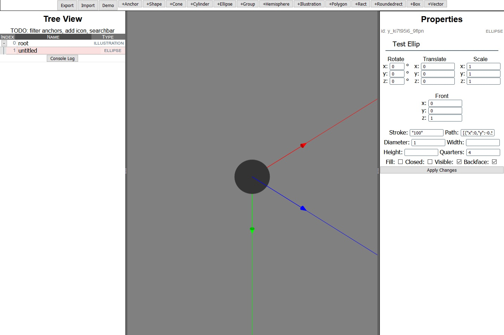

# Writing Log

I've been waiting/hoping for a Zdog editor to be released, but it was over a year since the discussion on Github started, and I've only seen one prototype. Starting November 2020, I set out to make my own.

I'm not sure If I'll regret using JavaScript. After asking around, it's definitely a goal to learn Rust/WebAssembly for a faster implementation.

## Goals and Features

Since there's a possibility of other people releasing their Zdog editors, I wanted mine to focus on rigging and animation. I wanted to animation a parrot's wingflap, and I got frustrated with the lack of visual feedback and the absolute coordinate system. This would require keyframes and coming up with an animation structure.

Right off the bat, I need:
- Modeling and editing properties
- Generate keyframes and transformations
- Play them

The only experience I have is tinkering with animation behavior graphs for modding the video game Skyrim, as some folks made XML parsers of the propritary Havok format. [nifskope](http://www.niftools.org/) is an open source graphics editor not meant for modeling, but for preparing models to the game format. Still, its UI and look is what I am aiming for, and Zdog is simple in comparison.

## 1. Application Structure

Because of the animation requirement, the JSON structure for importing and exporting is flat instead of nested. Thus, `Ztree` was made as an import/export abstraction. Hopefully it will become part of a larger "Zdog Rigger" system.

The Ztree object stores the nodes and relations as Map objects for lookup, while the relationMap stores a <parentid, Set> to prevent duplicate child ids.

_Figure 1: The first UI iteration displays the object data while organizing the tree view._

## Editor UI

I picked [Vue 3](https://v3.vuejs.org/) for the data binding and modularization that makes it easy to manage complex components.

| Feature         | Notes                  |
|-----------------|---------------------------|
|Rust| Need to familiarize with this language first. Looks promising. After using [Desandro's Spooky House](https://codepen.io/desandro/pen/OJLYxEB) as a worst-case test scenario, the performance could be improved.|
| Undo Redo | For now, the Zdog model snapshot is stored in JSON string and rehydrated.|
| Camera controls | Basic panning and zooming. I'm too dumb to figure out a real camera for now. I think I will use Cartesian for the World coords and polar for the Eye. |
|Widgets|Planning to implement with HTML5Canvas. This may need to be rendered in canvas instead of the DOM for performance. What 3D editor doesn't have widgets? I found an article proposing a [TouchSketch][1] widget for mobile, and I really like the idea. If it works for mobile, it'll work well for desktop, especially when paired with hotkeys to constrain transformations to an axis.|
|indexDB|Planning. For offline editing if the program starts using a server. Need a basic DB wrapper: Lovefield+Firebase? Or something else?|
|World Axes| Need to implement toggle and in the future, customization?|
|Embeds| Done, but needs formatting/UI work. Produces HTML-ready elements that can be copy-pasted into a document and display Zdog.|

_Figure 2: Displaying the world axes and transforming the properties into suitable input UIs._

## Credits and stuff
- [Split Grid](https://github.com/nathancahill/split/tree/master/packages/split-grid) Panels

## References List
1: [TouchSketch][1]

- [Phoria.js](https://github.com/kevinroast/phoria.js/blob/master/scripts/phoria-view.js) - Canvas 3D renderer
- [Canvas Matrix Transforms](https://riptutorial.com/html5-canvas/example/19666/a-transformation-matrix-to-track-translated--rotated---scaled-shape-s-)
- [JavaScript 3D Rendering](https://www.sitepoint.com/building-3d-engine-javascript/)
- [Zdog SVG importer](https://github.com/sakamies/zdog-svg-importer)

[1]: <https://hal.archives-ouvertes.fr/hal-01222203/document> (widget proposal for touchscreen)

