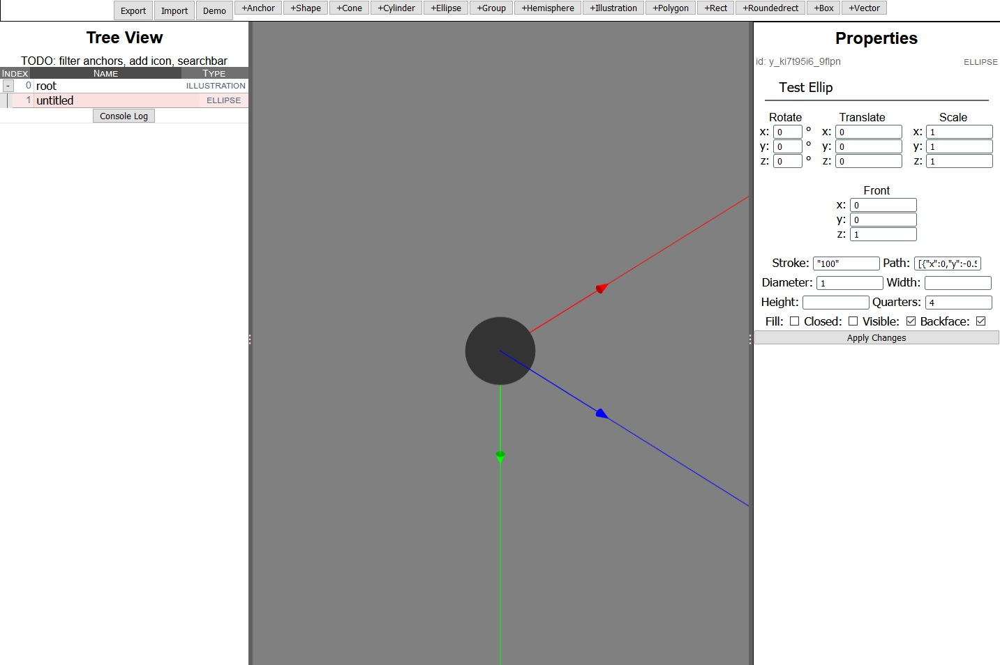

# Writing Log

I've been waiting/hoping for a Zdog editor to be released, but it was over a year since the discussion on Github started, and I've only seen one prototype. Starting November 2020, I set out to make my own.

I'm not sure If I'll regret using JavaScript. It might be better to learn Rust or WebAssembly first because a graphics editor is performance intensive, but I figured it wouldn't hurt to try.

## Goals and Features

Since there's a possibility of other people releasing their Zdog editors, I wanted mine to focus on rigging and animation. I wanted to animation a parrot's wingflap, and I got frustrated with the lack of visual feedback and the absolute coordinate system. This would require keyframes and coming up with an animation structure.

So right off the bat, I needed:
- Modeling and editing properties
- Generate keyframes and transformations
- Play them

The only experience I have is tinkering with animation behavior graphs for modding the video game Skyrim, as some folks made XML parsers of the propritary Havok format. [nifskope](http://www.niftools.org/) is also an open source graphics editor that is not meant for modeling, but for preparing models to the game format. Still, its UI and look is what I am aiming for, and Zdog is simple in comparison.

## 1. Application Structure

Because of the animation requirement, I knew I had to come up with a JSON structure for importing and exporting. I also needed a way to assign names to nodes, and generating unique IDs, and rehydrating their types. Thus, Ztree was made. Hopefully it will become part of a larger Zdog Rigger system.
```
Ztree JSON
{
  illustration: e_df435_4534,
  nodes: [{
    id: e_df435_4534,
    assignedName: "MyIllustration",
    type: 8,
    rotation: {x:0,y:0,z:0},
      ...
    },
    {
    id: c_sfrr4_4jn3,
    assignedName: "Base",
    type: 0,
    rotation: {x:0,y:0,z:0},
      ...
    },
    ...
  ],
  relations:[{
    parent: e_df435_4534,
    children: [
      c_sfrr4_4jn3,
        ...
      ]
  }]
}
```
I want to keep the list flat instead of nesting children. I'm going on a hunch that it will help with performance when applying transforms. The Ztree object stores the nodes and relations as Map objects for lookup, while the relationMap stores a <parentid, Set> to prevent duplicate child ids.


_Figure 1: The first UI iteration displays the object data while organizing the tree view._

## Editor UI

I picked [Vue 3](https://v3.vuejs.org/) for the data binding and modularization that makes it easy to manage complex components.

| Feature         | Notes                  |
|-----------------|---------------------------|
| Undo Redo | I had some issues with Vuex store, since I was storing the Ztree in it, and Vuex made a deepcopy of the actual Zdog model with all of its objects _every_ time a change was made, and this was a hard lesson. I had to redo a few references and I'm still thinking about performance of this feature. For now, the Zdog model is stored in JSON form and rehydrated.                   |
| Camera controls | Basic panning and zooming. I tried making a real camera, but it was starting to increase the complexity and I'm too dumb to figure it out right now. It would be good for a later project when world rendering is needed. I think I will use Cartesian for the World coords and polar for the Eye. |
|Shape Selection|This was also an [issue](https://github.com/metafizzy/zdog/issues/75) I was keen about. At first, I tried integrating the Canvas Path2D object and isPointInStroke API into the library. I also saved ctx.getTransform() as a property before redraw cleared it. Then, the inverse transformation matrix is applied to correlate screen click coordinates to the canvas coordinates. It worked for some shapes but not for the composite shapes, so I'm currently implementing the ghost canvas method. I may go with a hybrid approach with the transform matrix, aka only apply transformation on click, as I need to familiarize myself for when it's time to animate models|
|Widgets|Planning to implement with HTML5Canvas. This may need to be rendered in canvas instead of the DOM for performance reasons. What 3D editor doesn't have widgets? I found an article proposing a [TouchSketch][1] widget for mobile, and I really like the idea. If it works for mobile, it'll work well for desktop, especially when paired with hotkeys to constrain transformations to an axis.|
|indexDB|Planning. For offline editing if the program starts using a server. Need a basic DB wrapper, Lovefield/Firebase?|
|World Axes| Right now, the Axes are normal Zdog shapes, and they scale as you zoom in. At least for the world axes, I want to create a Zdog.Axis that will render, situate itself in the middle of the Flat Graph order, and stay at 1px thickness.|



_Figure 2: Displaying the world axes and transforming the properties into suitable input UIs._

## Credits and stuff
- [Split Grid](https://github.com/nathancahill/split/tree/master/packages/split-grid) Panels

## References List
1: [TouchSketch][1]

- [Zdog 3D Helpers](https://observablehq.com/@mootari/zdog-helpers)
- [Phoria.js](https://github.com/kevinroast/phoria.js/blob/master/scripts/phoria-view.js) - Canvas 3D renderer
- [Canvas Matrix Transforms](https://riptutorial.com/html5-canvas/example/19666/a-transformation-matrix-to-track-translated--rotated---scaled-shape-s-)
- [JavaScript 3D Rendering](https://www.sitepoint.com/building-3d-engine-javascript/)

[1]: <https://hal.archives-ouvertes.fr/hal-01222203/document> (widget proposal for touchscreen)
